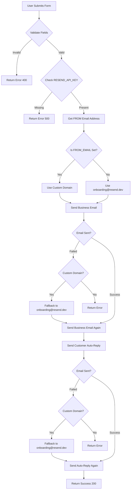

# Contact Form Email Setup Guide

## Quick Start

The contact form uses **Resend** (v4.7.0) to send two emails per submission: business notification
and customer auto-reply. Works immediately with `onboarding@resend.dev` - no domain verification
needed.

**Minimum Setup:**

1. Get Resend API key from [resend.com](https://resend.com)
2. Add to `.env.local`: `RESEND_API_KEY=re_your_key`
3. Add: `BUSINESS_EMAIL=williamjxj@gmail.com`
4. Done! Emails work immediately.

> **Note**: Google Maps integration is documented separately in [GOOGLE_MAPS.md](./GOOGLE_MAPS.md)

## Contact Form Submission Flow



## Email Address Usage

| Email Address                  | Purpose                            | Usage                                                         | When Required                                 |
| ------------------------------ | ---------------------------------- | ------------------------------------------------------------- | --------------------------------------------- |
| `onboarding@resend.dev`        | **FROM address** (default)         | Sender for both business notification and customer auto-reply | ✅ Always available (default)                 |
| `contact@bestitconsultants.ca` | **FROM address** (custom domain)   | Alternative sender - requires domain verification             | ❌ Optional (only if `FROM_EMAIL` is set)     |
| `williamjxj@gmail.com`         | **TO address** (business email)    | Receives contact form submissions                             | ✅ Required (default or via `BUSINESS_EMAIL`) |
| Customer's email               | **TO address** (customer)          | Receives auto-reply confirmation                              | ✅ From form submission                       |
| Customer's email               | **REPLY_TO** (business email)      | Allows direct reply to customer                               | ✅ Auto-set in business notification          |
| `williamjxj@gmail.com`         | **REPLY_TO** (customer auto-reply) | Ensures replies come to business                              | ✅ Auto-set in customer auto-reply            |

### Email Flow Details

**Business Notification Email:**

- **FROM**: `onboarding@resend.dev` (default) or `contact@bestitconsultants.ca` (if set)
- **TO**: `williamjxj@gmail.com` (or `BUSINESS_EMAIL`)
- **REPLY_TO**: Customer's email (enables direct reply)
- **Purpose**: Notify you of new contact form submission

**Customer Auto-Reply Email:**

- **FROM**: `onboarding@resend.dev` (default) or `contact@bestitconsultants.ca` (if set)
- **TO**: Customer's email (from form)
- **REPLY_TO**: `williamjxj@gmail.com` (or `BUSINESS_EMAIL`)
- **Purpose**: Confirm receipt and provide next steps

## Advanced Configuration

### Email Address Priority Logic

The system uses intelligent fallback to ensure emails are always sent:

1. **Primary**: If `FROM_EMAIL` or `RESEND_FROM_EMAIL` is **not set** → Uses
   `BestITConsultants <onboarding@resend.dev>` (works immediately)

2. **Upgrade**: If `FROM_EMAIL` or `RESEND_FROM_EMAIL` **is set** → Uses custom domain email (e.g.,
   `BestITConsultants <contact@bestitconsultants.ca>`)

3. **Automatic Fallback**: If custom domain email fails (not verified) → Automatically retries with
   `onboarding@resend.dev`

4. **Error Handling**: If both attempts fail → Returns error to user

### Environment Variables

**Required:**

```bash
RESEND_API_KEY=re_your_api_key_here
BUSINESS_EMAIL=williamjxj@gmail.com
```

**Optional:**

```bash
# Only set AFTER verifying domain in Resend dashboard
FROM_EMAIL=BestITConsultants <contact@bestitconsultants.ca>
# OR
RESEND_FROM_EMAIL=BestITConsultants <contact@bestitconsultants.ca>
```

| Variable            | Required | Default                 | Description                                 |
| ------------------- | -------- | ----------------------- | ------------------------------------------- |
| `RESEND_API_KEY`    | ✅ Yes   | None                    | Resend API key (starts with `re_`)          |
| `BUSINESS_EMAIL`    | ✅ Yes   | `williamjxj@gmail.com`  | Where contact submissions are sent          |
| `FROM_EMAIL`        | ❌ No    | `onboarding@resend.dev` | Custom FROM address (requires verification) |
| `RESEND_FROM_EMAIL` | ❌ No    | `onboarding@resend.dev` | Alternative name for `FROM_EMAIL`           |

### Custom Domain Setup

**To use `contact@bestitconsultants.ca`:**

1. **Verify Domain in Resend:**
   - Go to [Resend Dashboard → Domains](https://resend.com/domains)
   - Add domain `bestitconsultants.ca`
   - Get DNS records (SPF, DKIM, DMARC)

2. **Add DNS Records:**
   - Add TXT records to your domain registrar
   - Wait for DNS propagation (5-60 minutes)

3. **Set Environment Variable:**

   ```bash
   FROM_EMAIL=BestITConsultants <contact@bestitconsultants.ca>
   ```

4. **System Automatically:**
   - Uses custom domain if verified
   - Falls back to `onboarding@resend.dev` if verification fails

## Form Fields

**Required:**

- Name
- Email
- Message

**Optional:**

- Company
- Phone
- Service Needed
- Project Budget
- Project Timeline
- Newsletter Subscription

## Email Templates

### Business Notification Email

**Location:** `src/app/api/contact/route.ts` (variable: `businessEmailHtml`)

**Content:**

- Contact information (name, email, company, phone)
- Project details (service, budget, timeline, newsletter)
- Full customer message
- Reply-To set to customer's email

### Customer Auto-Reply Email

**Location:** `src/app/api/contact/route.ts` (variable: `customerEmailHtml`)

**Content:**

- Personalized greeting
- Message summary
- Next steps (24-hour review, consultation call)
- Company contact information
- Professional signature

## Troubleshooting

### Common Issues

1. **"Module 'resend' not found"**
   - Run: `npm install resend`

2. **"Email service not configured"**
   - Check: `RESEND_API_KEY` is set in `.env.local`
   - Verify: API key starts with `re_`
   - Restart: Development server

3. **Emails not sending**
   - ✅ Verify `RESEND_API_KEY` is correct
   - ✅ Verify `BUSINESS_EMAIL` is set
   - ✅ Check Resend dashboard for API key status
   - ✅ Check browser console and server logs

4. **Custom domain fails (fallback works)**
   - Expected: System automatically uses `onboarding@resend.dev`
   - Fix: Verify domain in Resend dashboard
   - Check: DNS records are correctly added
   - Wait: DNS propagation (up to 24 hours)

5. **Form validation errors**
   - Required: Name, Email, Message
   - Error: "Name, email, and message are required fields"

6. **Form submission fails**
   - Check: Browser Network tab
   - Check: Server logs
   - Verify: `/api/contact` endpoint is accessible

## Production Deployment

**Required Environment Variables:**

```bash
RESEND_API_KEY=re_your_production_api_key
BUSINESS_EMAIL=williamjxj@gmail.com
```

**Optional (Recommended):**

```bash
FROM_EMAIL=BestITConsultants <contact@bestitconsultants.ca>
```

**Deployment Checklist:**

1. ✅ Set environment variables in hosting platform
2. ✅ Verify domain in Resend (if using custom domain)
3. ✅ Test email delivery on production
4. ✅ Monitor logs and Resend dashboard

**Platform-Specific:**

- **Vercel**: Project Settings → Environment Variables
- **Netlify**: Site Settings → Environment Variables
- **Other**: Follow platform documentation

## Security

- ✅ Server-side form validation
- ✅ Environment variables for API keys
- ✅ CORS protection via Next.js API routes
- ⚠️ Rate limiting recommended (not implemented)
- ⚠️ reCAPTCHA recommended (not implemented)

## File Structure

```
src/
├── app/
│   ├── api/
│   │   └── contact/
│   │       └── route.ts          # Email API endpoint
│   └── contact/
│       └── page.tsx              # Contact form page
└── ...
```

## Dependencies

- `resend`: `^4.7.0` (already in `package.json`)

## Related Documentation

- [Google Maps Integration](./GOOGLE_MAPS.md) - Google Maps setup and configuration
