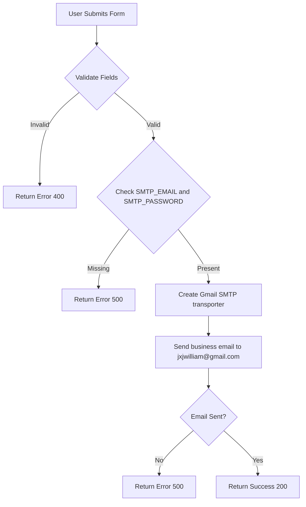

# Contact Form Email Setup Guide

## Quick Start

The contact form now uses **Gmail SMTP via nodemailer** to send the business notification email.
The receiver is fixed to `jxjwilliam@gmail.com`, matching the reference implementation.

**Minimum Setup:**

1. Add to `.env.local`: `SMTP_EMAIL=your_gmail_address@gmail.com`
2. Add to `.env.local`: `SMTP_PASSWORD=your_gmail_app_password`
3. Restart the Next.js dev server so the new environment variables are loaded
4. Submit the contact form and check `jxjwilliam@gmail.com`

> **Note**: Google Maps integration is documented separately in [GOOGLE_MAPS.md](./GOOGLE_MAPS.md)

## Contact Form Submission Flow


```mermaid
flowchart TD
    A[User Submits Form] --> B{Validate Fields}
    B -->|Invalid| C[Return Error 400]
    B -->|Valid| D{Check SMTP_EMAIL and SMTP_PASSWORD}
    D -->|Missing| E[Return Error 500]
    D -->|Present| F[Create Gmail SMTP transporter]
    F --> G[Send business email to jxjwilliam@gmail.com]
    G --> H{Email Sent?}
    H -->|No| I[Return Error 500]
    H -->|Yes| J[Return Success 200]
```

## Email Address Usage

| Email Address           | Purpose                         | Usage                              | When Required |
| ----------------------- | ------------------------------- | ---------------------------------- | ------------- |
| `SMTP_EMAIL`            | SMTP login sender               | Gmail account used to send mail    | ✅ Required   |
| `SMTP_PASSWORD`         | SMTP app password               | Gmail app password for nodemailer   | ✅ Required   |
| `jxjwilliam@gmail.com`  | Business inbox                  | Receives contact form submissions   | ✅ Fixed      |
| Visitor email           | Reply-to header                  | Lets you reply directly to sender   | ✅ From form  |

### Email Flow Details

**Business Notification Email:**

- **FROM**: `SMTP_EMAIL`
- **TO**: `jxjwilliam@gmail.com`
- **REPLY_TO**: Customer's email (enables direct reply)
- **Purpose**: Notify you of new contact form submission

There is no customer auto-reply in the SMTP version. The form now mirrors the reference
implementation and sends the submission directly to the business inbox.

### Environment Variables

**Required:**

```bash
SMTP_EMAIL=your_gmail_address@gmail.com
SMTP_PASSWORD=your_gmail_app_password
```

| Variable       | Required | Default | Description                      |
| -------------- | -------- | ------- | -------------------------------- |
| `SMTP_EMAIL`   | ✅ Yes   | None    | Gmail address used to send mail  |
| `SMTP_PASSWORD`| ✅ Yes   | None    | Gmail app password               |

### Gmail Setup

Use a Gmail account with app passwords enabled:

1. Sign in to the Gmail account you want to send from
2. Enable 2-Step Verification if it is not already on
3. Create an App Password for Mail
4. Paste that app password into `SMTP_PASSWORD`

## Form Fields

**Required:**

- Name
- Email
- Message

**Optional:**

- Company
- Phone
- Service Needed
- Project Budget
- Project Timeline
- Newsletter Subscription

## Email Templates

### Business Notification Email

**Location:** `src/app/api/contact/route.ts` (variable: `businessEmailHtml`)

**Content:**

- Contact information (name, email, company, phone)
- Project details (service, budget, timeline, newsletter)
- Full customer message
- Reply-To set to customer's email

## Troubleshooting

### Common Issues

1. **"Email service not configured"**
   - Check: `SMTP_EMAIL` is set in `.env.local`
   - Check: `SMTP_PASSWORD` is set in `.env.local`
   - Restart: Development server after editing `.env.local`

2. **Emails not sending**
   - ✅ Verify `SMTP_EMAIL` is correct
   - ✅ Verify `SMTP_PASSWORD` is a Gmail app password
   - ✅ Check browser console and server logs

3. **Form validation errors**
   - Required: Name, Email, Message
   - Error: "Name, email, and message are required fields"

4. **Form submission fails**
   - Check: Browser Network tab
   - Check: Server logs
   - Verify: `/api/contact` endpoint is accessible

## Production Deployment

**Required Environment Variables:**

```bash
SMTP_EMAIL=your_gmail_address@gmail.com
SMTP_PASSWORD=your_gmail_app_password
```

**Deployment Checklist:**

1. ✅ Set environment variables in hosting platform
2. ✅ Test email delivery on production
3. ✅ Monitor logs and server output

**Platform-Specific:**

- **Vercel**: Project Settings → Environment Variables
- **Netlify**: Site Settings → Environment Variables
- **Other**: Follow platform documentation

## Security

- ✅ Server-side form validation
- ✅ Environment variables for API keys
- ✅ CORS protection via Next.js API routes
- ⚠️ Rate limiting recommended (not implemented)
- ⚠️ reCAPTCHA recommended (not implemented)

## File Structure

```
src/
├── app/
│   ├── api/
│   │   └── contact/
│   │       └── route.ts          # Email API endpoint
│   └── contact/
│       └── page.tsx              # Contact form page
└── ...
```

## Dependencies

- `nodemailer`: `^6.10.1`

## Related Documentation

- [Google Maps Integration](./GOOGLE_MAPS.md) - Google Maps setup and configuration
